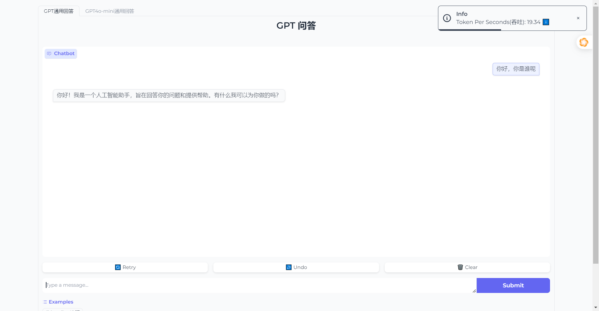
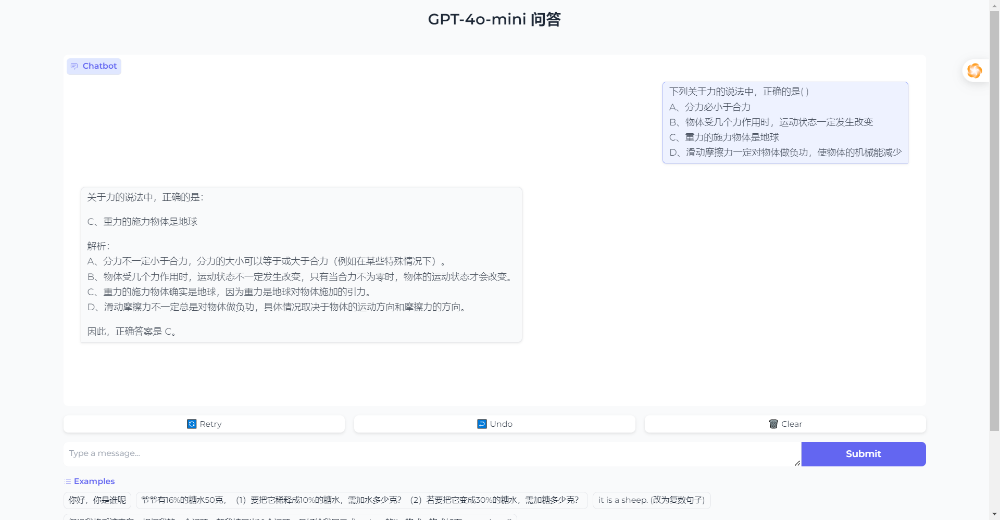
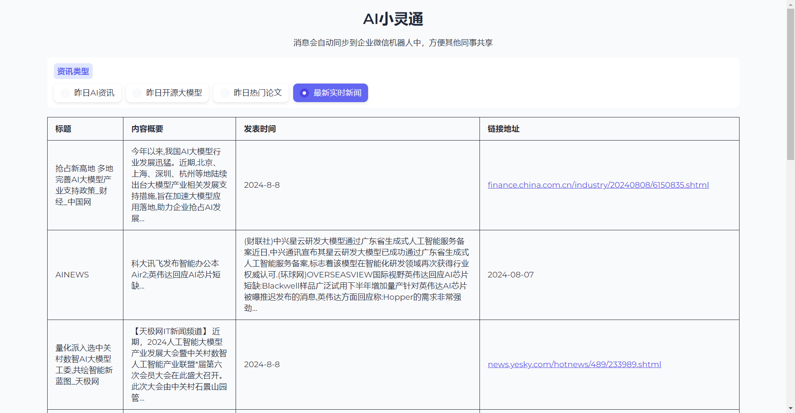
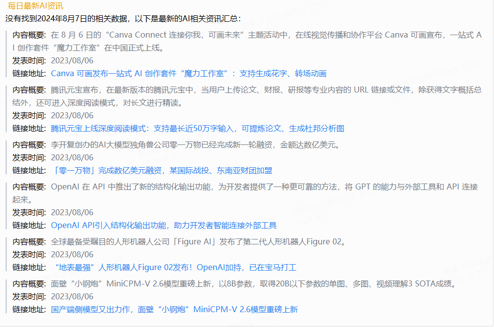
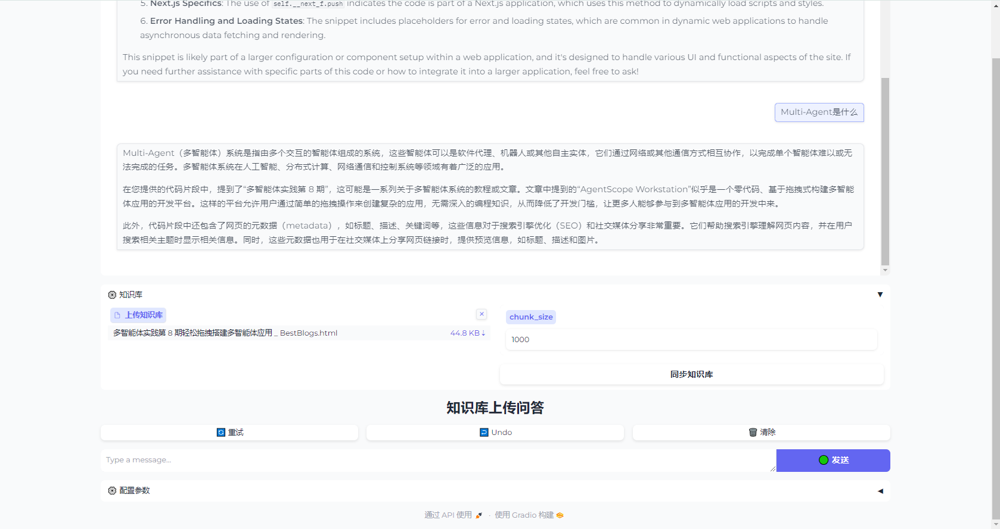

# gpt-demo

- 提供 gpt 以及本地大模型 demo
- 简单对话聊天
- 复杂的解决方案

## demo 列表

- [x] 通用对话 chat
- [x] gpt4o_mini_chat 多模态
- [x] 企业微信 ai 资讯小助手
- [x] 知识库问答
- [ ] gpt4o_chat 多模态
- [ ] vllm 本地大模型支持适配
- [ ] vllm 支持 glm_4_9b_chat
- [ ] vllm 支持 glm_4v_9b 多模态
- [ ] 撰写博客助手
- [ ] 羽毛球比赛识别
- [ ] 图片文档解析助手
- [ ] pdf 文档解析助手
- [ ] 医护人员诊前小护士病情收集
- [ ] 法律助手
- [ ] 文生图创意制作
- [ ] 解题小助手

## Install

```bash
pip install git+https://github.com/aigc-open/gpt-demo.git
```

# GPT 版本系列

## online chat all in one

```bash
python3 -m gpt_demo.chat -p 7899
```



## gpt4o-mini-chat

```bash
python3 -m gpt_demo.gpt4o_mini_chat -p 7899 -e examples_file.json
```

- 其中-e 可以自定义示例文件



## gpt ai 资讯小助手(企业微信 ai 资讯小助手)

- 将企业微信 webhook key 填入环境变量中

```bash
python3 -m gpt_demo.news_spider run -p 7899
```




## 知识库问答

- 上传知识库
- 根据知识库近似搜索，进行 llm rag 知识库问答
- 项目依赖: https://github.com/aigc-open/llm-knowledge-function
    - 生成级别的api接口：xxxx

```bash
python3 -m gpt_demo.simple_knowledge_chat -p 40002
```



# VLLM 本地大模型版本系列
